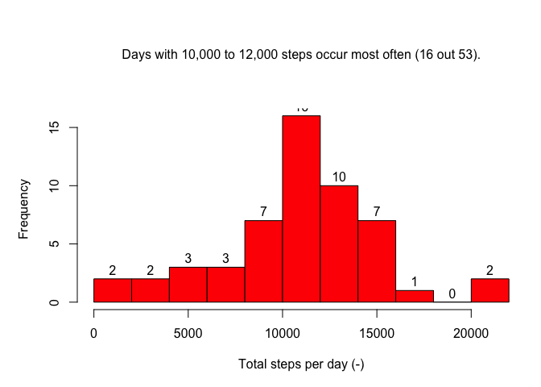

# Reproducible Research: Peer Assessment 1


## Loading and preprocessing the data

The excercise starts by loading the activity data.

```r
fdata_orig <- read.csv("activity.csv")
```

The 'interval' data is of class 'integer', which does not make it suitable for nice time series plots. Therefor, it is converted to class 'POSIXt'.

```r
d1 <- sprintf("%04d", as.numeric(fdata_orig$interval))
d2 <- format(strptime(d1, format="%H%M"), format = "%H:%M")
d3 <- as.POSIXct(d2, format="%H:%M")
fdata_orig$interval <- d3
```

Later on, the missing data (NA) will be imputed with averaged data. Therefore, we already make a copy of the data.

```r
fdata <- fdata_orig
```


## What is mean total number of steps taken per day?

The total steps per day (pd) is calculated using the 'aggregate' function. Note, we use the original data, which still includes NA's. To get a meaningfull result we add the term 'na.rm=TRUE'.

```r
tot_steps_pd_orig <- aggregate(steps ~ date, fdata_orig, sum, na.rm=TRUE)
```

The distribution of the total steps per days shows that days with 10,000 to 12,000 steps occur most often: 16 days out of 53. Although there are 61 dates in the dataset, only 53 have data. Apparently, the other 8 dates have NA only. We will investigate this later. I have tried to make the '16' visible, the title does not seem to be the problem. Not sure what is.

```r
par(mar=c(5,5,7,1))
hist(tot_steps_pd_orig$steps, col="red", xlab="Total steps per day (-)",
     ylab="Frequency", main=NULL,
     breaks=10, labels=TRUE)
mtext("Days with 10,000 to 12,000 steps occur most often (16 out 53).", line=3)
```

<!-- -->

This allows us to calculate the mean and median of the total number of steps per day,

```r
mean(tot_steps_pd_orig$steps)
```

```
## [1] 10766.19
```

```r
median(tot_steps_pd_orig$steps)
```

```
## [1] 10765
```


## What is the average daily activity pattern?
First, we calculate the average number of steps for each 5-min time interval across all days. And, we find the most active 5-min interval.

```r
avg_steps_per_interv_orig <- aggregate(steps ~ interval, fdata_orig, mean, na.rm=TRUE)
find_max_orig <- which.max(avg_steps_per_interv_orig$steps)
```

This we can then plot, which indicates that 8:35AM is the most active 5-min interval. 

```r
par(mar=c(5,5,7,1))
plot(avg_steps_per_interv_orig, type="l")
points(avg_steps_per_interv_orig[find_max_orig,],col="red", pch=19)
mtext("The most active 5-min interval is around 8:35AM.", line = 3)
```

<!-- -->


## Imputing missing values

The total number of missing values in the dataset, i.e. the total number of rows with NA, can easily be calculated as,

```r
sum(!complete.cases(fdata_orig))
```

```
## [1] 2304
```

Now we will replace all missing values in the 'steps' column with the mean for that 5-minute interval. We create a new dataset that is equal to the original dataset but with the missing data filled in. For this we use a copy of the original dataset, see above,

```r
fdata$steps <- ifelse(is.na(fdata$steps),
                      avg_steps_per_interv_orig$steps[match(fdata$interv, avg_steps_per_interv_orig$interv)],
                      fdata$steps)
```


Again. we make a histogram of the total daily number of steps. Now, we use the dataset where each NA has been replaced by the average value for that 5-min time interval.

```r
tot_steps_pd <- aggregate(steps ~ date, fdata, sum, na.rm=TRUE)

par(mar=c(5,5,7,1))
hist(tot_steps_pd$steps, col="red", xlab="Total steps per day (-)",
     ylab="Frequency", main=NULL,
     breaks=10, labels=TRUE)
mtext("Days with 10,000 to 12,000 steps occur most often (24 out 61).", line=3)
```

<!-- -->

Interestingly, we see that all bins keep the same size, except the one on the middle which includes the average total per day. This rises from 16 to 24 (+8), and obviously the total of all bins has increased from 53 to 61 (also +8). This suggests that all NA's in the original dataset occur in the 8 concerned days, and none occur in the other days. Let's check this by calculating the number of NA's for each day - how are NA's distributed across days?


```r
no_NA_pd <- lapply(split(fdata_orig,fdata_orig$date), 
                   function (fdata_orig) {sum(is.na(fdata_orig$steps))})
table(as.numeric(no_NA_pd))
```

```
## 
##   0 288 
##  53   8
```

BINGO! We see that 53 days have 0 NA's and 8 days have each 288 NA's, which is the total number of observations per day (= 24*60/5). 

Let's have a look at the mean and median of the total number of steps per day using the imputed dataset,

```r
mean(tot_steps_pd$steps)
```

```
## [1] 10766.19
```

```r
median(tot_steps_pd$steps)
```

```
## [1] 10766.19
```

The question arise, do these values differ from the estimates from the first part of the assignment? And, what is the impact of imputing missing data on the estimates of the total daily number of steps?

MEAN: NO, there is no difference between the two datasets. There is no impact of the imputted data. This can be easily explained by the fact that the NA's are replaced by average numbers, and these obviously will not affect the average.

MEDIAN: YES, there is a difference. The imputted data causes the median to change. In the original dataset, the median is a whole number, because steps are counted as full steps. The imputted datasets get another 8 days with data that correspond to the average data. And these will end up in the middle of the overall set of days. So, the median will become equal to the average (mean). 


## Are there differences in activity patterns between weekdays and weekends?

We determine the weekday (Monday, Tuesday, ..) and the type of day (Weekday or Weekend),

```r
fdata$weekday <- with(fdata, weekdays(as.Date(fdata$date, format="%Y-%m-%d")))

fdata$daytype <- with(fdata, ifelse(fdata$weekday %in% c("Saturday","Sunday"),
                                                  "Weekend",
                                                  "Weekday"))
```

Using daytype, we can calculate the average daily number of steps during the weekdays and during the weekend. To better understand the weekend results, we can do the same for Saturday and Sunday,

```r
avg_steps_per_interv_weekday <- aggregate(steps ~ interval,
                                                 fdata[fdata$daytype=="Weekday",],
                                                 FUN=mean)
avg_steps_per_interv_weekend <- aggregate(steps ~ interval,
                                                 fdata[fdata$daytype=="Weekend",],
                                                 FUN=mean)

avg_steps_per_interv_Saturday <- aggregate(steps ~ interval,
                                                 fdata[fdata$weekday=="Saturday",],
                                                 FUN=mean)

avg_steps_per_interv_Sunday <- aggregate(steps ~ interval,
                                                  fdata[fdata$weekday=="Sunday",],
                                                  FUN=mean)
```

Now we can plot the data. Observing the weekday data (figure A), we can conclude that most activity takes place between 8:05-9:15 hour (grey dotted lines). In the weekend (figure B), fewer steps are taken and the morning peak is less pronounced, and occurs later 8:15-9:35 hour (grey dotted lines). Also, we see more 'early' activity on Saturday than on Sunday. So, yes, there is a difference between weekdays and weekends.

```r
par(mfrow=c(2,1), oma=c(5,5,7,1), mar=c(0,0,0,0), cex=2)

plot(avg_steps_per_interv_weekday, xaxt="n", ylim=c(0,250), type="l", lwd=3)
abline(v=avg_steps_per_interv_weekday$interval[c(98,112)],lty=3,lwd=3,col="grey40")
text(avg_steps_per_interv_weekday$interval[1], 150, "(A)", adj=0)
legend(avg_steps_per_interv_weekend$interval[20], 225, c("Weekday"), lty=1, lwd=2.5, col="black")

plot(avg_steps_per_interv_weekend, ylim=c(0,250), type="l", lwd=3)
lines(avg_steps_per_interv_Saturday, col="red", lwd=2)
lines(avg_steps_per_interv_Sunday, col="blue", lwd=2)
abline(v=avg_steps_per_interv_weekend$interval[c(100,116)],lty=3,lwd=3,col="grey40")
text(avg_steps_per_interv_weekend$interval[1], 150, "(B)", adj=0)
legend(avg_steps_per_interv_weekend$interval[20], 225, c("Weekend", "Saturday", "Sunday"), lty=c(1, 1, 1), lwd=c(2.5, 2.5, 2.5), col=c("black", "red", "blue"))

mtext("More activity during weekdays than in weekends, and more early activity on Saturday than on Sunday.", outer=TRUE, line = 1, cex=2)
mtext("Average #steps per 5-min time interval", side=2, line=3, outer=TRUE, srt=90, cex=2)
mtext("Time Interval (0:00 - 23:55 hours)", side=1, line=3, outer=TRUE, cex=2)
```

<!-- -->
