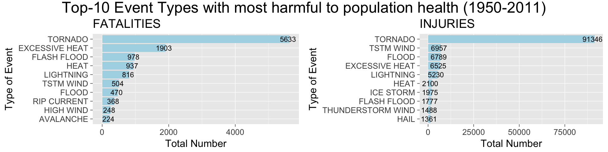
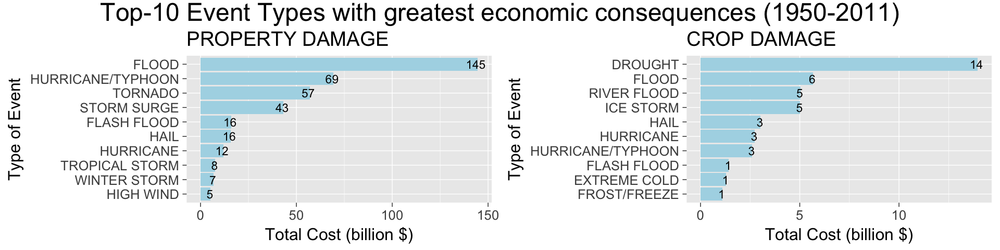

# Analyses of NOAA Storm Data (1950 - Nov 2011)

This report has been generated for Course Project 2 of the module "Reproducible Research" which is part of the Data Science Specialization.

The data originates from the U.S. National Oceanic and Atmospheric Administration's (NOAA) storm database.

## Synopsis

Accumulated US storm data (1950 till 2011) have been assessed to determine the impact of events on population health and economy. The general question is which event types are most impactful, e.g. tornado, flood and drought. Two health impacts have been investigated, fatalities and injuries. And in terms of economic consequences, property and crop damages have been looked at (billions USD).
Tornados have led to most deaths and injuries in the US in the period 1950-2011. Property damage is most affected by floods. Crop damage is mostly affected by too little (drought) or too much water (floods).

## Loading and preprocessing of the data

Before loading the storm data, we first activate the R libraries which will be used in the analyses of the storm data.

```r
library(ggplot2)
library(dplyr)
```

```
## 
## Attaching package: 'dplyr'
```

```
## The following objects are masked from 'package:stats':
## 
##     filter, lag
```

```
## The following objects are masked from 'package:base':
## 
##     intersect, setdiff, setequal, union
```

```r
library(reshape2)
library(grid)
library(gridExtra)
```

```
## 
## Attaching package: 'gridExtra'
```

```
## The following object is masked from 'package:dplyr':
## 
##     combine
```

After ensuring we are in the right working directory, we load the storm data:

```r
setwd('~/Documents/Github Repos/DataScienceSpecialisation/5. Reproducible Research/week 4')
sourcedata <- read.csv("repdata-data-StormData.csv.bz2")
```

The property and crop damage cost are given in the columns "PROPDMG" and "CROPDMG". However, the value could be in dollars, 1000s, millions or billions of dollars, depending on the value in the columns "PROPDMGEXP" and "CROPDMGEXP". To be able to add up all cost, the cost are recalculated in billions of dollars, in 2 new columns "PROPDMG_DOLLAR" and "CROPDMG_DOLLAR":

```r
sourcedata$PROPDMG_DOLLAR <- with(sourcedata,
                             ifelse(PROPDMGEXP=="B", PROPDMG,
                             ifelse(PROPDMGEXP=="M", PROPDMG/1e3,
                             ifelse(PROPDMGEXP=="K", PROPDMG/1e6, PROPDMG/1e9))))

sourcedata$CROPDMG_DOLLAR <- with(sourcedata,
                             ifelse(CROPDMGEXP=="B", CROPDMG,
                             ifelse(CROPDMGEXP=="M", CROPDMG/1e3,
                             ifelse(CROPDMGEXP=="K", CROPDMG/1e6, CROPDMG/1e9))))
```

To save memory and to focus the analyses on the data that is of concern, a new data object is created (fdata) that only receives the columns of interest. In addition, all other objects are removed from memory:

```r
fdata <- subset(sourcedata, select=c(EVTYPE,
                                     FATALITIES, INJURIES, 
                                     PROPDMG_DOLLAR, CROPDMG_DOLLAR))
rm(list=setdiff(ls(), "fdata"))
```

In order to assess which event types are most harmful to population health and have greatest economic consequences, the impact data needs to be aggregated by event type. Subsequently, subsets are taken from each of the datasets, resulting in a top-10 for each impact,

```r
fdata_fatalities1 <- setNames(aggregate(fdata$FATALITIES, by=list(fdata$EVTYPE),
                        FUN=sum, na.rm=TRUE), c("EVTYPE", "FATALITIES"))
fdata_injuries1 <- setNames(aggregate(fdata$INJURIES, by=list(fdata$EVTYPE),
                        FUN=sum, na.rm=TRUE), c("EVTYPE", "INJURIES"))
fdata_propdmg1 <- setNames(aggregate(fdata$PROPDMG_DOLLAR, by=list(fdata$EVTYPE),
                        FUN=sum, na.rm=TRUE), c("EVTYPE", "PROPDMG"))
fdata_cropdmg1 <- setNames(aggregate(fdata$CROPDMG_DOLLAR, by=list(fdata$EVTYPE),
                        FUN=sum, na.rm=TRUE), c("EVTYPE", "CROPDMG"))

fdata_fatalities2 <- subset(fdata_fatalities1, FATALITIES>220)
fdata_injuries2 <- subset(fdata_injuries1, INJURIES>1350)
fdata_propdmg2 <- subset(fdata_propdmg1, PROPDMG>5.2)
fdata_cropdmg2 <- subset(fdata_cropdmg1, CROPDMG>1)
```
Here, the threshold has been tuned so "subset" resulted in 10 event types. Of course, there will be smarter ways to select a top-10.

## RESULTS

### Which types of events are most harmful to population health?

Two bar charts are created with the top-10 Event Types that resulted in most fatalities and injuries accumulated from 1950 till November 2011.

```r
f <-  ggplot(data=fdata_fatalities2, aes(x=reorder(EVTYPE,FATALITIES), 
                                         y=FATALITIES)) +
        geom_bar(stat="identity", fill="lightblue") + coord_flip() +
        geom_text(aes(label=FATALITIES), hjust=0.6, size=6) +
        labs(title = "FATALITIES") +
        labs(x = "Type of Event", y ="Total Number") +
        theme_grey(base_size = 24)

g <-  ggplot(data=fdata_injuries2, aes(x=reorder(EVTYPE,INJURIES),
                                       y=INJURIES)) +
        geom_bar(stat="identity", fill="lightblue") + coord_flip() +
        geom_text(aes(label=INJURIES), hjust=0.6, size=6) +
        labs(title = "INJURIES") +
        labs(x = "Type of Event", y ="Total Number") +
        theme_grey(base_size = 24)

maintitle <- textGrob("Top-10 Event Types with most harmful to population health (1950-2011)", gp=gpar(vjust=0.7, fontsize=36, font=8))

grid.arrange(f, g, nrow=1, ncol=2, top=maintitle)
```

<!-- -->


The figure above shows that tornados resulted in by far most deaths and injuries. While excessive heat resulted in a large number of deaths it resulted in relatively fewer injuries. It may be of interest to calculate the ratio injuries/death. For example, for every death in excessive heat there were ~3.4 injuries (6525/1903), while for tornados this ratio was 16 injuries per death.
Flash flood is #3 in the list, while flood is #7. This is not surprising since the abrupt occurence of such an event (flash flood) will increase the death toll. 
It is also of interest to see that tornados had such a high number of injuries versus the other event types (#1 vs >#1). The ratio between #1 and #2 in fatalities is 3 (=5633/1903), while for injuries this ratio is 13 (=91346/6957).

### Which types of events have the greatest economic consequences?

Two bar charts are created with the top-10 Event Types that resulted in greatest economic consequences accumulated from 1950 till November 2011.

```r
k <-  ggplot(data=fdata_propdmg2, aes(x=reorder(EVTYPE,PROPDMG), y=PROPDMG)) +
        geom_bar(stat="identity", fill="lightblue") + coord_flip() +
        geom_text(aes(label=round(PROPDMG)), hjust=0.6, size=6) +
        labs(title = "PROPERTY DAMAGE") +
        labs(x = "Type of Event", y ="Total Cost (billion $)") +
        theme_grey(base_size = 24)

l <-  ggplot(data=fdata_cropdmg2, aes(x=reorder(EVTYPE,CROPDMG), y=CROPDMG)) +
        geom_bar(stat="identity", fill="lightblue") + coord_flip() +
        geom_text(aes(label=round(CROPDMG)), hjust=0.6, size=6) +
        labs(title = "CROP DAMAGE") +
        labs(x = "Type of Event", y ="Total Cost (billion $)") +
        theme_grey(base_size = 24)

maintitle <- textGrob("Top-10 Event Types with greatest economic consequences (1950-2011)", gp=gpar(vjust=0.7, fontsize=36, font=8))

grid.arrange(k, l, nrow=1, ncol=2, top=maintitle)
```

<!-- -->

Interestingly, in the figure above we see that floods resulted in by far most property damage (USD145bn), while another event type (drought) resulted highest crop damage (USD14bn). Also note the difference in order of magnitude between the two.
Hurricanes/typhoons and tornados come behind floods when it comes to property damage.
